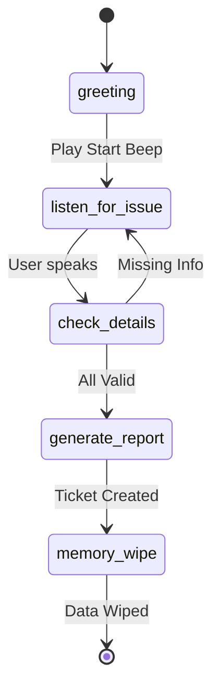

# MCD 311 Sovereign Voice AI - Project Documentation

## 1. Executive Summary
**Project Name:** MCD 311 Sovereign Voice AI (Project Sahayta)
**Goal:** To provide a completely offline, privacy-first, voice-enabled grievance redressal system for municipal corporations (MCD).
**Core Philosophy:** "Data Sovereignty" — No citizen data ever leaves the local infrastructure. All AI processing (STT, LLM, TTS) happens locally. All memory is ephemeral (RAM-only) and wiped after the call.

---

## 2. System Architecture

The system follows a **Event-Driven Microservices Architecture** orchestrating a real-time voice conversation loop.

### High-Level Diagram
```mermaid
graph TD
    Client[Next.js Frontend] <-->|WebSocket (Audio/Text)| Server[FastAPI Backend]
    Server <-->|State/Session| Redis[Redis (Ephemeral Memory)]
    Server <-->|Inference| Ollama[Ollama LLM (Mistral/Neural-Chat)]
    Server -->|TTS Generation| gTTS[Audio Processor]
```

### Key Technologies
| Component | Technology | Role |
|-----------|------------|------|
| **Frontend** | Next.js 14, React 18, Tailwind | User Interface, Audio Capture, Visualization |
| **Backend** | Python 3.10+, FastAPI | WebSocket Server, Orchestration Logic |
| **Database** | Redis (In-Memory) | Ephemeral Session State (TTL-based) |
| **AI Model** | Ollama (Mistral/Neural-Chat) | Intent Classification, Reasoning, Entity Extraction |
| **Audio** | gTTS / SpeechRecognition | Text-to-Speech & Speech-to-Text |
| **Orchestration** | PowerShell | Process Management & Verification |

---

## 3. Backend Components (`/src`)

The backend is the brain of the operation, designed to run completely offline.

### 3.1. Main Server (`websocket_server_integrated.py`)
- **Role:** Entry point for the application.
- **Functionality:**
    - Hosts the WebSocket endpoint `/ws/call`.
    - Manages client connections via `StreamingConnectionManager`.
    - Coordinate the "Talk -> Listen -> Think -> Act" loop.
    - Sends real-time updates (text chunks, audio chunks, sovereignty meter data) to the frontend.

### 3.2. Memory Manager (`src/memory_manager.py`)
- **Role:** Guardian of Data Sovereignty.
- **Functionality:**
    - Connects to **Redis**.
    - Stores session data (Citizen Name, Phone, Grievance) with a strict **Time-To-Live (TTL)**.
    - Implements the `memory_wipe_node` function which cryptographically shreds data from memory after the call ends.
    - **Zero Persistence:** Ensures no data is ever written to the hard disk.

### 3.3. LLM Integration (`src/llm_integration.py`)
- **Role:** Interface for Local Intelligence.
- **Functionality:**
    - Connects to the local **Ollama** instance.
    - Implements a **Dual-Path Architecture**:
        - **Fast Path (Mistral):** For quick categorization and simple queries.
        - **Deep Path (Neural-Chat/Llama):** For complex reasoning and escalation decisions.
    - Parses generic JSON responses from models into structured data for the application.

### 3.4. Workflow Engine (`src/workflow.py`)
- **Role:** State Machine for Call Flow.
- **Functionality:**
    - Uses **LangGraph** to define a deterministic Finite State Machine (FSM).
    - States: `INITIATE_CALL` -> `LISTEN` -> `CATEGORIZE` -> `VALIDATE` -> `ESCALATE` -> `MEMORY_WIPE`.
    - Ensures the agent follows strict municipal protocols and cannot be "hallucinated" into unauthorized actions.

### 3.5. Audio Processor (`src/audio_processor.py`)
- **Role:** Voice Input/Output.
- **Functionality:**
    - **TTS:** Uses `gTTS` (Google Text-to-Speech) to convert system text responses into Audio (Base64 encoded MP3) for the frontend to play.
    - **STT:** (Planned) Local Whisper model to convert user speech to text.

---

## 4. Frontend Components (`/frontend`)

The frontend is a futuristic, highly interactive dashboard designed to build trust through transparency.

### 4.1. Core Pages
- **`pages/index.tsx`**: The main dashboard. It manages the layout, connecting the Dialpad, Feed, and Visualizers.
- **`pages/_app.tsx`**: Handles global styles (Tailwind) and fonts.

### 4.2. UI Components (`/components`)
- **`GlassmorphismDialpad.tsx`**: 
    - The primary interaction point. 
    - Features a digital display, tactile keys, and a dedicated "Call 311" button.
    - Includes logic to restrict calls to '311' only.
- **`IntelligenceFeed.tsx`**: 
    - A "Matrix-style" scrolling log that shows *exactly* what the AI is thinking.
    - Displays categorization results, confidence scores, and priority levels.
    - **Purpose:** Transparency. The user sees the AI parsing their request in real-time.
- **`SovereigntyMeter.tsx`**: 
    - A specialized gauge showing how many data points are currently held in memory.
    - Visually confirms when data is wiped (meter drops to zero) at the end of a call.
- **`WaveformVisualizer.tsx`**: 
    - A Canvas-based audio visualizer.
    - Displays a sine wave that reacts to audio (or idles breahting) to indicate the system is "alive".

---

## 5. Deployment & Usage

### Prerequisites
1. **Python 3.10+** (Backend)
2. **Node.js 18+** (Frontend)
3. **Redis** (Running on port 6379)
4. **Ollama** (Running on port 11434 with `mistral` model pulled)

### Startup Sequence
The project uses a master orchestration script `launch_all.ps1` to handle the complexity.

1. **Redis Check:** Script verifies Redis is running.
2. **Backend Launch:** 
    - Activates Python virtual environment (`venv`).
    - Sets `PYTHONIOENCODING=utf-8` (crucial for Windows).
    - Starts Uvicorn server on `localhost:8000`.
3. **Frontend Launch:**
    - Starts Next.js development server on `localhost:3000`.

### Troubleshooting Common Issues
- **"Internal Server Error" / Backend Crash:** Usually due to missing models in Ollama or incorrect API response parsing. Run `diagnose_backend.py` to check connections.
- **"Dead" UI:** Ensure backend is running. The UI needs the WebSocket connection to animate fully.
- **Audio Issues:** Check `gTTS` installation and ensuring browser auto-play permissions are granted.

---

## 6. Advanced Implementation Guide

### 6.1. Local Model Strategy (The "Fast Path")

**Challenge:** Avoid running two separate models (8B and 70B) simultaneously on 16GB RAM; they will fight for memory and cause lag.

**Solution:** Use a **Single High-Performance Model** (Llama 3.1 8B or Mistral Nemo) with an Optimized Inference Engine.

#### Model Recommendation
- **Model:** `llama3.1:8b-instruct-q4_K_M` (Uses ~5GB RAM)
- **Installation:**
  ```bash
  ollama pull llama3.1:8b-instruct-q4_K_M
  ```

#### Latency Optimization Trick
Set the `num_predict` parameter to a low value for conversational nodes to get instant "Speech-to-Text" feedback.

```python
response = ollama.chat(
    model='llama3.1:8b-instruct-q4_K_M',
    messages=[{'role': 'user', 'content': prompt}],
    options={'num_predict': 50}  # Short, fast responses
)
```

#### Hardware Setup (Plan B - Distributed Inference)
If it gets slow, host Ollama on **Laptop 2** and change your `OLLAMA_HOST` env variable:

```bash
# In .env file
OLLAMA_BASE_URL=http://<laptop-2-ip>:11434
```

---

### 6.2. Implementing the "Turn-Taking Beep"

To let the user know when to speak, we insert a **VAD-triggered sound** (Voice Activity Detection).

#### Logic Flow
1. **AI finishes speaking** → Trigger Beep (High Pitch 880Hz).
2. System waits for user input.
3. **User stops speaking** (Silence detected for 800ms) → Trigger Processing Beep (Low Pitch 440Hz).

#### Python Implementation (`audio_processor.py`)

Add this function to your audio processor:

```python
import winsound  # Windows only

def play_status_beep(beep_type='start'):
    """
    Play status beep to indicate system state.
    
    Args:
        beep_type: 'start' (ready to listen) or 'processing' (analyzing)
    """
    if beep_type == 'start':
        # High pitch - ready for input
        winsound.Beep(880, 200)  # 880Hz for 200ms
    elif beep_type == 'processing':
        # Low pitch - processing
        winsound.Beep(440, 150)  # 440Hz for 150ms
```

#### Integration into Workflow

```python
# In websocket_server_integrated.py
async def handle_call_flow(session_id):
    # AI speaks
    await send_tts_audio(session_id, "Please state your grievance.")
    
    # Trigger beep to indicate "your turn"
    audio_processor.play_status_beep('start')
    
    # Wait for user speech
    user_input = await receive_stt_input(session_id)
    
    # Trigger processing beep
    audio_processor.play_status_beep('processing')
    
    # Process with LLM
    response = llm.categorize_grievance(user_input)
```

---

### 6.3. The "MCD Street Light" State Machine Guide

This is the roadmap for your LangGraph nodes.

| Node | Action | Logic |
|------|--------|-------|
| **greeting** | AI greets user | Trigger: Call Start |
| **listen_for_issue** | Captures issue | Play Beep (880Hz) → Listen |
| **check_details** | Validates Location | If location missing → Loop back to listen |
| **generate_report** | Creates JSON | Format data for Left-Side UI component |
| **memory_wipe** | Cleanup | Delete Session ID from Redis |

#### State Transition Diagram



---

### 6.4. Copilot Implementation Prompts

Copy-paste these into GitHub Copilot to accelerate development.

#### A. The "Sovereign Dialpad" (Next.js)

**Prompt:**
```
Create a Next.js 14 functional component called SovereignDialpad. Use Tailwind CSS for a dark glassmorphism style. It should have a numeric keypad (0-9, *, #) and a large green '311' button. When 311 is pressed, trigger a WebSocket connection to localhost:8000/ws/call. Add a visual indicator (a glowing green dot) labeled 'Local Encrypted Tunnel' to show the connection is private.
```

**File:** `frontend/components/SovereignDialpad.tsx`

---

#### B. The "Beep & Listen" Logic (Python)

**Prompt:**
```
Write a Python function play_status_beep(type='start') using the winsound library. If type is 'start', play a frequency of 880Hz for 200ms. If type is 'processing', play 440Hz for 150ms. Integrate this into the LangGraph loop so it triggers after the TTS finishes speaking and before the STT starts listening.
```

**File:** `src/audio_processor.py`

---

#### C. The "Winning Moment" Visualization (React)

**Prompt:**
```
Create a React component LiveGrievanceReport. It should display fields for 'Ticket ID', 'Issue Category', 'Ward/Location', and 'Timestamp'. The data should update in real-time based on the 'entity_extracted' events from the WebSocket. When the call ends, show a 'DATA WIPED' stamp across the component.
```

**File:** `frontend/components/LiveGrievanceReport.tsx`

---

### 6.5. Technical Specifications Summary

#### Memory Budget (16GB RAM System)
| Component | RAM Usage | Notes |
|-----------|-----------|-------|
| **OS + Background** | 4GB | Windows baseline |
| **Ollama (Llama 3.1 8B Q4)** | 5GB | Quantized for efficiency |
| **Redis** | 500MB | Ephemeral session data |
| **Python Backend** | 1GB | FastAPI + Dependencies |
| **Next.js Frontend** | 1.5GB | Development mode |
| **Browser** | 2GB | Chrome/Edge with audio |
| **Available Buffer** | 2GB | For OS operations |

#### Network Architecture (Dual-Laptop Setup)

```
┌─────────────────┐         ┌─────────────────┐
│   Laptop 1      │         │   Laptop 2      │
│  (Frontend +    │◄────────┤  (Ollama Only)  │
│   Orchestration)│  LAN    │                 │
│                 │         │  Port: 11434    │
└─────────────────┘         └─────────────────┘
     │
     │ WebSocket
     ▼
  Browser
```

---

## 7. Future Roadmap
- **Local STT:** Replace browser/mock STT with local Whisper model for full offline privacy.
- **Hindi Support:** Add language switching capability.
- **Biometric Voice ID:** (Optional) Verify senior citizens via voice print locally.
- **VAD Integration:** Implement Voice Activity Detection for natural conversation flow.
- **Multi-Language TTS:** Add support for regional Indian languages using Coqui TTS.
